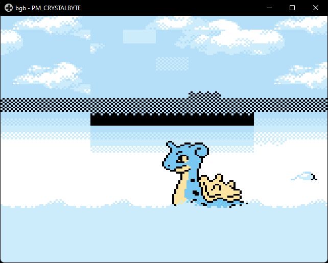

# Gold/Silver Intro Movie Port to Pokecrystal

This pokecrystal branch brings the Intro Movie from `pokegold` to `pokecrystal`. This branch may be used to build a git `.patch` file for the purposes of adding the Gold/Silver Intro Movie to your Romhack.

## Patch Instructions

To build a patch simply download [Gs-Intro-Movie.patch](https://github.com/pret/pokecrystal/compare/1d97d41ea2be9cd99c7e5688f128b1b6568262c5...thegsproj:GS-Intro-Movie.patch) and place it somewhere where you will remember the location and that is accessible by .git. Then open terminal window and `cd` into your `pokecrystal/` directory. Then run the following command:

```git
git apply /path/to/Gs-Intro-Movie.patch
```

*Note: You may receive warnings about whitepace and EOF, this should be fine.*

If you receive an error message that the patch failed to apply, you may need to resolve some conflicts. Run the following command to generate reject files.

```git
git apply --reject /patch/to/Gs-Intro-Movie.patch
```

This should apply the patch where it is able, and files with conflicts will output as a `.rej` extension. You will need to resolve these conflicts manually.

## Notes on Key Changes

This branch not only adds the Gold/Silver Intro movie and dependency stuff (graphics, code, ect) it also deletes the no longer needed Crystal Intro Movie dependency stuff. There are a few extra changes that should be noted:

### Lapras Graphical Bug

The following change was needed to avoid a graphical problem in the Lapras scene. 



```diff
 ld d, a
+; The next line was originally set to hCurSpriteYCoord,
+; however, this caused graphical issues. Not sure why
+; this needs to be set to hCurSpriteYPixel instead.
-ld hl, hCurSpriteYCoord
+ld hl, hCurSpriteYPixel
 add hl, de
```

### Crystal Title Screen Graphical Bug

The following changes were needed to avoid a graphical problem in the Crystal Title screen. I belive this was due to the Crystal Title screen not properly cleaning up. I ported some of the cleanup code from the Gold/Silver Title screens. Its very possible I went overkill here, and not all of the changes are needed to fix this bug. 


`engine/movie/title.asm    ~Lines 1-5`

```diff
_TitleScreen:
     call ClearBGPalettes
-    call ClearSprites
     call ClearTilemap
+    call DisableLCD
+    call ClearSprites
```

`engine/movie/title.asm     ~Lines 18-26`

```diff
-; Turn LCD off
-    call DisableLCD
+    ldh [hMapAnims], a
+    ldh [hSCY], a
+    ldh [hSCX], a
+
+    ld hl, vTile0
+    ld bc, $200 tiles
+    xor a
+    call ByteFill
+    farcall ClearSpriteAnims
```

### WRAM wLYOverrides2 addition

I needed to add a `wLYOverrides2` buffer to `wram.asm`. This requires an additional 144 bytes of wram. I placed it in approximately the same location as pokegold, near `wLYOverrides`. I also removed 106 bytes that was empty nearby.

`wram.asm`

```diff
 wLYOverrides:: ds SCREEN_HEIGHT_PX
 wLYOverridesEnd::

-    ds 1
+wLYOverrides2:: ds SCREEN_HEIGHT_PX
+wLYOverrides2End::

 wMagnetTrain:: ; used only for BANK(wMagnetTrain)
 wMagnetTrainDirection:: db
 wMagnetTrainInitPosition:: db
 wMagnetTrainHoldPosition:: db
 wMagnetTrainFinalPosition:: db
 wMagnetTrainPlayerSpriteInitX:: db

-    ds 106
-
 wLYOverridesBackup:: ds SCREEN_HEIGHT_PX
 wLYOverridesBackupEnd::
```
